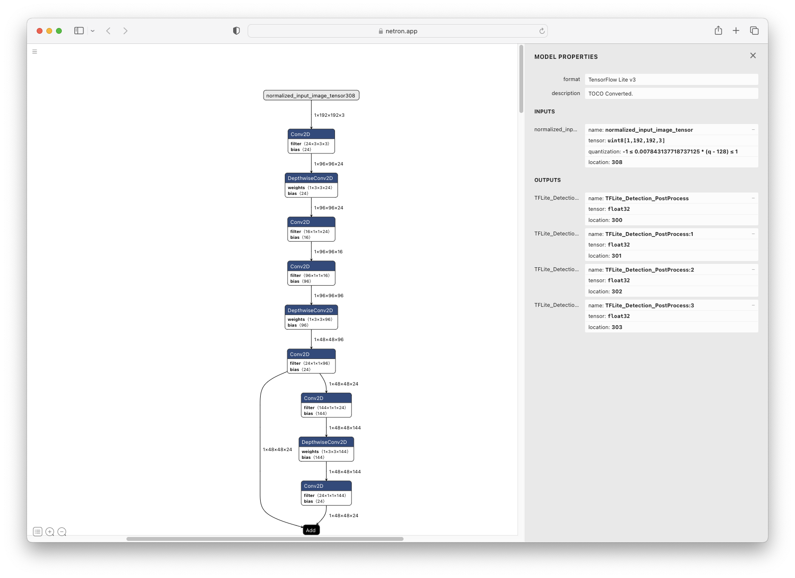
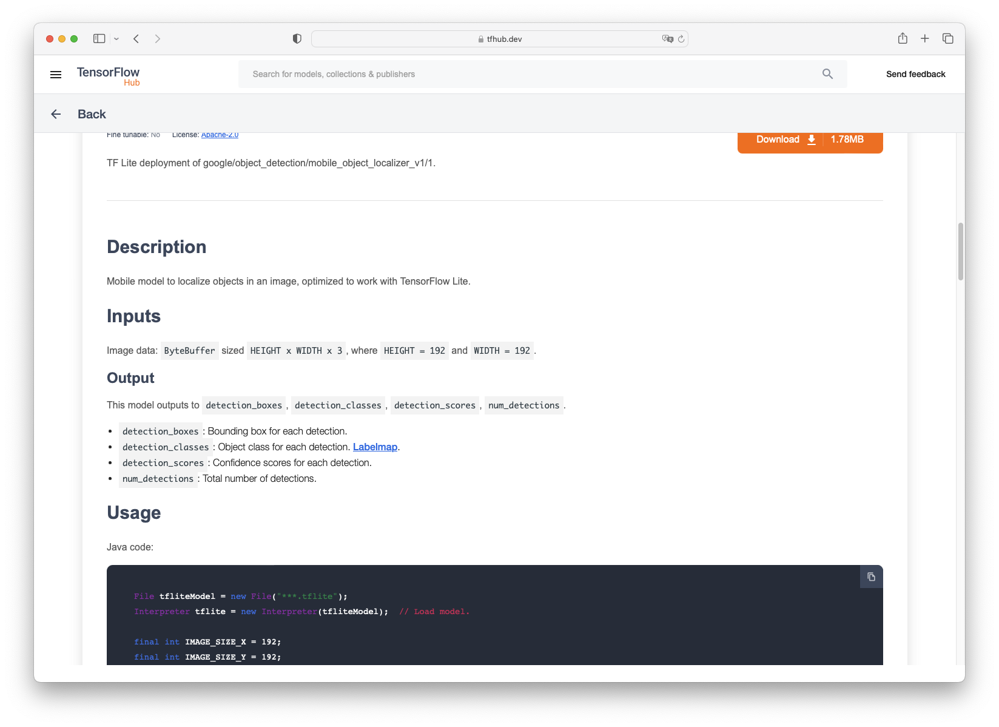

<a href="https://margelo.io">
  
</a>

# react-native-fast-tflite

🔥 High-performance [TensorFlow Lite](https://www.tensorflow.org/lite) library for React Native.

* 🔥 Powered by JSI
* 💨 Zero-copy ArrayBuffers
* 🔧 Uses the low-level C/C++ TensorFlow Lite core API for direct memory access
* 🔄 Supports fast-refresh for swapping out TensorFlow Models at runtime
* 🖥️ Supports GPU-accelerated delegates (CoreML/Metal/OpenGL)
* 📸 Easy [VisionCamera](https://github.com/mrousavy/react-native-vision-camera) integration

## Installation

1. Add the npm package
    ```sh
    yarn add react-native-fast-tflite
    ```
2. In `metro.config.js`, add `tflite` as a supported asset extension:
    ```js
    module.exports = {
        // ...
        resolver: {
            assetExts: ['tflite', // ...
            // ...
    ```
    This allows you to drop `.tflite` files into your app and swap them out at runtime without having to rebuild anything! 🔥
3. (Optional) If you want to enable the GPU Delegate, see ["Using GPU Delegates"](#using-gpu-delegates) down below.
4. Run your app (`yarn android` / `npx pod-install && yarn ios`)

## Usage

1. Find a TensorFlow Lite (`.tflite`) model you want to use. There's thousands of public models on [tfhub.dev](https://tfhub.dev).
2. Drag your TensorFlow Lite model into your React Native app's asset folder (e.g. `src/assets/my-model.tflite`)
3. Load the Model:
    ```ts
    // Option A: Standalone Function
    const model = await loadTensorflowModel(require('assets/my-model.tflite'))

    // Option B: Hook in a Function Component
    const plugin = useTensorflowModel(require('assets/my-model.tflite'))
    ```
4. Call the Model:
    ```ts
    const inputData = ...
    const outputData = await model.run(inputData)
    console.log(outputData)
    ```

### Loading Models

Models can be loaded either from the React Native bundle using a `require(..)` statement, or any kind of URI/URL (`http://..` or `file://..`):

```ts
// Asset from React Native Bundle
loadTensorflowModel(require('assets/my-model.tflite'))
// File on the local filesystem
loadTensorflowModel('file:///var/mobile/.../my-model.tflite')
// Remote URL
loadTensorflowModel('https://tfhub.dev/google/lite-model/object_detection/detector?lite-format=tflite')
```

Loading a Model is asynchronous since Buffers need to be allocated. Make sure to check for any potential errors when loading a Model.

### Input and Output data

TensorFlow uses _tensors_ as input and output formats. Since TensorFlow Lite is optimized to run on fixed array sized byte buffers, you are responsible for interpreting the raw data yourself.

To inspect the input and output tensors on your TensorFlow Lite model, open it in [Netron](https://netron.app).

For example, the `object_detection_mobile_object_localizer_v1_1_default_1.tflite` model I found on [tfhub.dev](https://tfhub.dev) has **1 input tensor** and **4 output tensors**:



In the description on [tfhub.dev](https://tfhub.dev) we can find the description of all tensors:



From that we now know that we need a 192 x 192 input image with 3 bytes per pixel (meaning RGB).

If you were to use this model with a [VisionCamera](https://github.com/mrousavy/react-native-vision-camera) Frame Processor, you would need to convert the Frame to this 192 x 192 x 3 byte array:

```tsx
const model = useTensorflowModel(require('object_detection.tflite'))

const frameProcessor = useFrameProcessor((frame) => {
    'worklet'
    if (model.state !== "loaded") return

    const data = frame.toArrayBuffer()
    // do RGB conversion if the Frame is not already in RGB Format
    const outputs = model.model.runSync([data])

    const detection_boxes = outputs[0]
    const detection_classes = outputs[1]
    const detection_scores = outputs[2]
    const num_detections = outputs[3]
    console.log(`Detected ${num_detections[0]} objects!`)

    for (let i = 0; i < detection_boxes.length; i += 4) {
        const confidence = detection_scores[i / 4]
        if (confidence > 0.7) {
            // Draw a red box around the object!
            const left = detection_boxes[i]
            const top = detection_boxes[i + 1]
            const right = detection_boxes[i + 2]
            const bottom = detection_boxes[i + 3]
            const rect = SkRect.Make(left, top, right, bottom)
            frame.drawRect(rect, SkColors.Red)
        }
    }
}, [model])

return (
    <Camera frameProcessor={frameProcessor} {...otherProps} />
)
```

### Using GPU Delegates

GPU Delegates offer faster, GPU accelerated computation. There's multiple different GPU delegates which you can enable:

#### CoreML (iOS)

To enable the CoreML Delegate, you need to include the CoreML/Metal code in your project:

1. Set `$EnableCoreMLDelegate` to true in your `Podfile`:
    ```ruby
    $EnableCoreMLDelegate=true

    # rest of your podfile...
    ```
2. Open your iOS project in Xcode and add the `CoreML` framework to your project:
    
3. Re-install Pods and build your app:
    ```sh
    cd ios && pod install && cd ..
    yarn ios
    ```
4. Use the CoreML Delegate:
    ```ts
    const model = await loadTensorflowModel(require('assets/my-model.tflite'), 'core-ml')
    ```

> [!NOTE]
> Since some operations aren't supported on the CoreML delegate, make sure your Model is able to use the CoreML GPU delegate.

## Android

Currently, react-native-fast-tflite does not work on Android.

The entire codebase is written in C/C++ and can be shared across platforms, but I couldn't manage to link tensorflow-lite against the NDK/CMake target on Android.
This is the only missing piece, so if anyone figures this part out, please let me know/send a PR.

My current approach was to use `org.tensorflow:tensorflow-lite` from Maven, extract the .so and Headers from the AAR, and then link against those (see `android/build.gradle` and `android/CMakeLists.txt`). For some reason this gave ABI errors, such as cannot link against linux x64, so for now I just ignored those and finished iOS.

## Contributing

1. Clone the repo
2. Make sure you have installed Xcode CLI tools such as `gcc`, `cmake` and `python`/`python3`. See the TensorFlow documentation on what you need exactly.
3. Run `yarn bootstrap` and select `y` (yes) on all iOS and Android related questions.
4. Open the Example app and start developing
   * iOS: `example/ios/TfliteExample.xcworkspace`
   * Android: `example/android`

See the [contributing guide](CONTRIBUTING.md) to learn how to contribute to the repository and the development workflow.

## License

MIT
